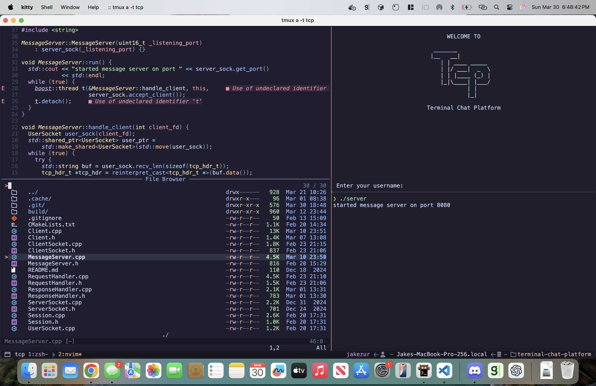

# dotfiles

This config is fast. Like, _never-touch-the-mouse-again_ fast.
We're talking full keyboard-driven power: file tree, fuzzy finding, live grep, inline diagnostics, LSPs that actually work, and floating terminals that pop up faster than your reflexes. All without ever reaching for that clunky plastic relic known as a mouse.
Mice are fine if you’re herding pixels in Photoshop. But for writing code? They’re just friction.
This setup is built for speed, clarity, and never leaving home row. If you want smooth, minimal, and ridiculously efficient workflows, you’re gonna like it here.

# examples

A few highlights from the setup:

<table>
  <tr>
    <td></td>
    <td></td>
    <td></td>
  </tr>
</table>
