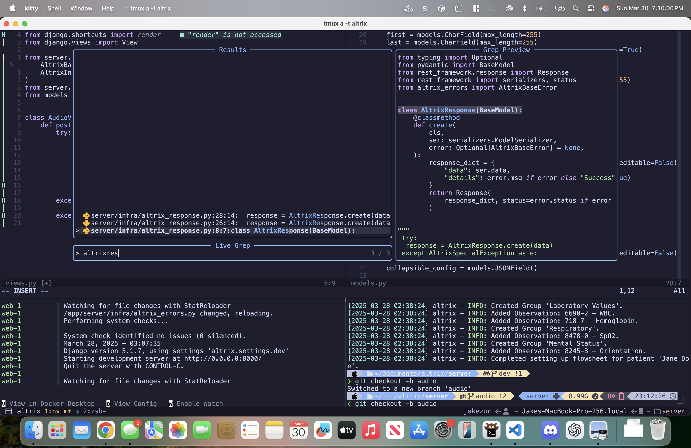

# dotfiles

This config is fast. Like, _never-touch-the-mouse-again_ fast.
We're talking full keyboard-driven power: file tree, fuzzy finding, live grep, inline diagnostics, LSPs that actually work, and floating terminals that pop up faster than your reflexes. All without ever reaching for that clunky plastic relic known as a mouse.
Mice? Mice are a disease. Clicking around your editor like a caveman dragging a cursor through molasses is no way to live. You’re writing code, not playing fortnite.
This setup is for people who aren’t afraid to ditch the mouse for good. You want flow? You want to stop fumbling around like a toddler in a GUI ball pit? Cool. You're in the right place.

# examples

A few highlights from the setup:

